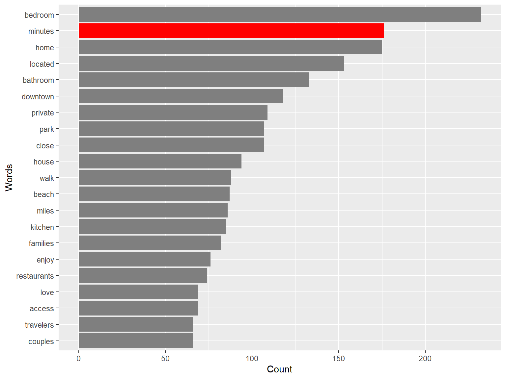
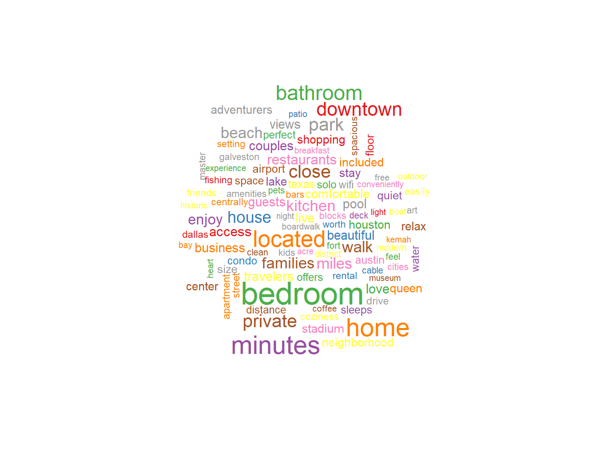

# Text analysis
Text analysis of reviews from booking

In this work, I analyze 401 reviews from booking. The initial dataset contains 18259 reviews. My work is an example of how you can prepare data set for text analysis. Preparation includes data cleaning,  work with corpus, remove common English words such as "a", "and", "the", etc.

Below you can see the most common words among reviews 

And this is the most common word in the word cloud.

